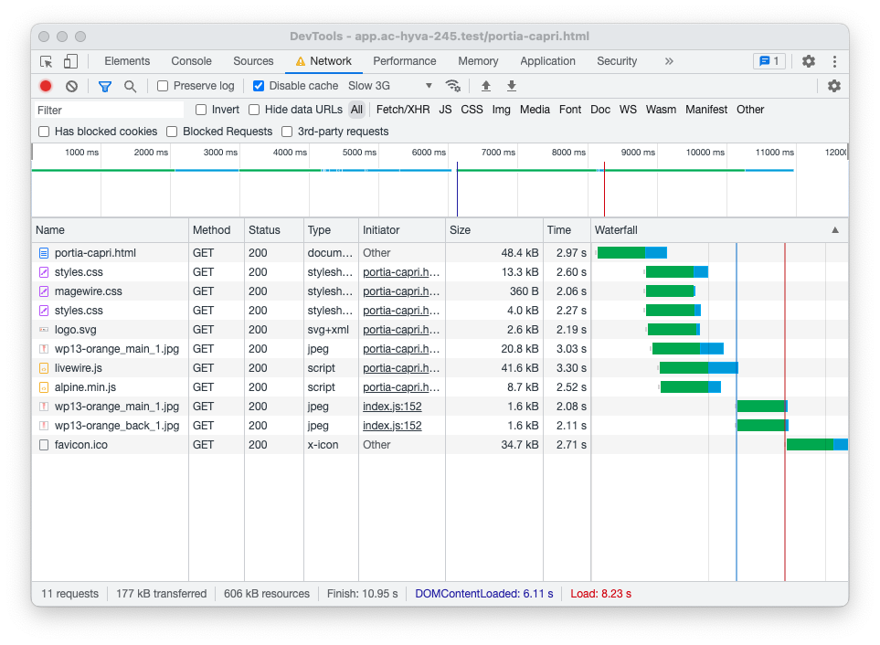
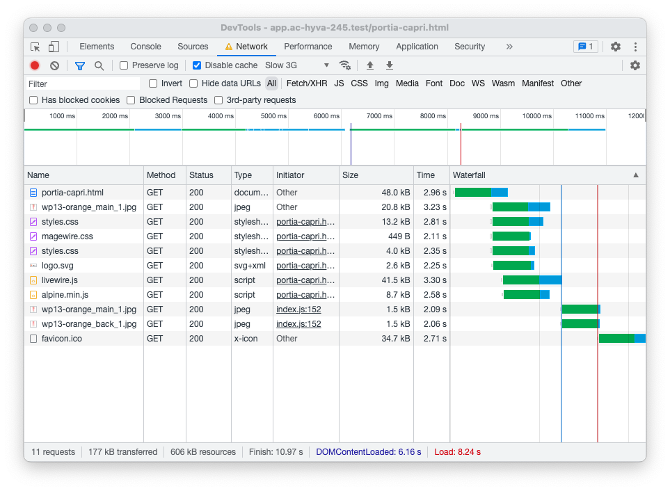

# Preload Images via HTTP Link response header

This module was built as an experiment during the MageUnConf Hackathon in Cologne, in September 2022.  

The goal is to improve the user experience by loading images that are guaranteed to be displayed above the fold earlier.  
The idea came out of interesting discussions with [Tsvetan Stoychev](https://twitter.com/ceckoslab) and his experience working at Akamai on the frontend performance team.

## Installation

Run the command

```sh
composer require friends-of-hyva/magento2-preload-images
```

## Usage:

Import the `Hyva\PreloadImages\ViewModel\PreloadImages` view model into your template and call the `add()` method, passing the image URL string as a parameter.

In Hyvä the ViewModelRegistry can be used, with Luma based themes the view model has to be passed into the template as a block argument using Layout XML.

### Hyvä Example:

```php
/** @var string $imageUrl */
$viewModels->require(PreloadImages::class)->add($imageUrl);
```


## Details

The preloading is triggered in the browser by a [`Link`](https://www.incoherent.ch/2021/10/18/http-link-header-early-hints-and-server-push.html) header.

Take this screenshot of a PDP waterfall chart on slow 3G without preloading:


You can see the main product image `wp13-orange_main_1.jpg` begins loading shortly after the `portia-capri.html` document is received.  
The browser requests the main product image after the css files used by the page.

Here is the screenshot of the same page with preloading:


With preloading, the browser requests the main product image before even the css files.

### Be aware!

The feature this module provides is well in the range of micro-optimization, and if used without care can harm a websites SEO metrics.  
If preloading an image improves the customer experience or a search engine ranking metric really depends on the site in question and the customer usage base.  

Also, it will require a relatively high amount of visitors and careful monitoring to determine if it improves the situation for the majority of visitors. 

## License

Copyright 2022 Vinai Kopp & Hyvä Themes BV

The module is released under the [BSD-3 Clause license](./LICENSE.txt).
